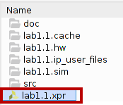

# Часть 1. Лабораторные работы HDL

## Список лабораторных работ
- lab1.1 - Комбинационная логика
- lab1.2 - Вывод буквы на семисегментный индикатор
- lab1.3 - Двоичный счётчик
- lab1.4 - Сдвиговый регистр
- lab1.5 - Динамическая индикация
## Работа с репозиторием
### Выбор проекта в Vivado

Для открытия проекта в Vivado требуется выбрать .xpr файл в директории с лабораторной работой.

Например в случае лабораторной работы 1.1 мы выбираем файл по пути:
```./MC_RISCV_MIREA/part1/lab1.1/lab1.1.xpr```

*1) Запуск GUI Vivado*


*2) Открыть проект*


*3) Выбор .xpr файла*



### Структура проекта
После запуска вы увидите окно с исходными файлами и иерархию проекта.

*1) Файл **arty_a7_wrapper.sv** является общим для всех лабораторных работ и представляет собой оболочку для подключения всех пинов вашего проекта к пинам ПЛИС на печатной плате. **Содержит только логику подключения модулей и пинов**. Модули sr_driver и slow_clk_gen необходимы для ввода/вывода информации на семисегментный индикатор.*


*2) Логика проекта и задание описано здесь в файле **top.sv**. Само задание описано комментарием в коде на английском языке, но так же вы можете найти описание на русском языке в директории проекта:
```part1/lab1.1/README.pdf```*


*3) Тестовый модуль **tb.sv** с описанием всех воздействий можно найти здесь:*


*3) Файл с подключениями пинов **arty_a7_pins.xdc**:*


**При желании вы можете воспользоваться текстовым редактором VSCode при выполнении работы.**


### Запуск симуляции в Vivado


### Генерация прошивки(bitstream для FPGA)

**Generate bitstream** запускает все процессы необходимые для получения готовой прошивки (файл /part1/lab1.1/lab1.1.runs/impl_1/.bit):

**Elaboration** -> **Synthesis** -> **Implementation** -> **Generate Bitstream**


### Загрузка прошивки(bitstream) на FPGA

*Для загрузки прошивки необходимо выбрать пункт **Open Hardware manager** -> **Open target** -> **Auto Connect**. Далее нужно выбрать файл c расширением.bit для загрузки*

