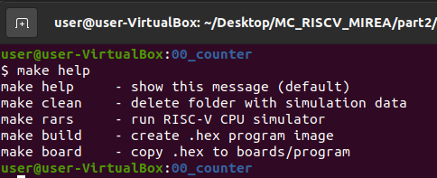
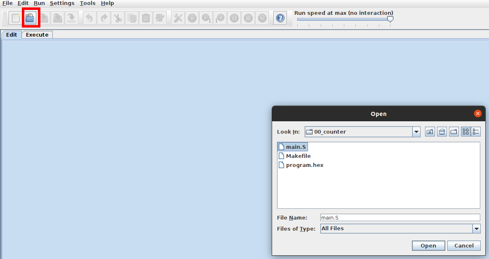
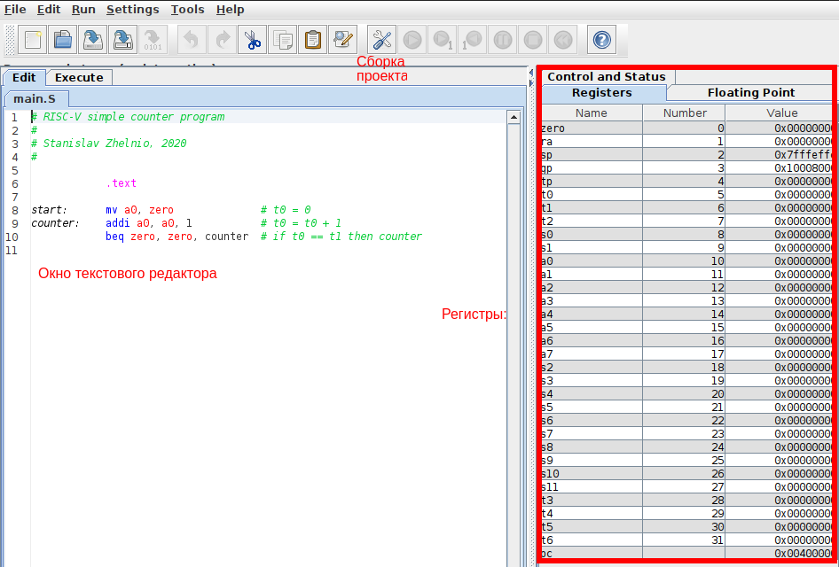
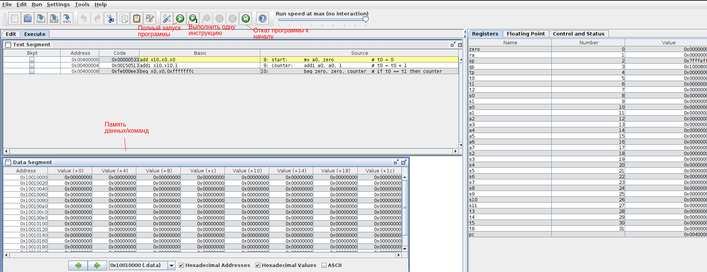

# Часть 2. Работа с симулятором Assembler RISC-V RARS

# Лабораторная работа №2
Используя примеры из директории **examples** реализуйте следующие программы:

- Счётчик который начинает отсчёт с 100 и доходит до 0
- Счётчик с инкрементом 4, вместо 1
- Счётчик который считает до 100 и останавливается
- Счётчик, который считает до 100, затем уменьшается до 0 и снова считает до 100 в цикле.

## Использование make

В папке с каждой программой-примером находится makefile. Его можно запустить из терминала Ubuntu.

Пример: ```./part2/examples/00_counter```

В папке с makefile c помощью **ПКМ -> Open in terminal**:



make help
```
make clean    - Удаление временных файлов
make rars     - Запуск симулятора асемблера RARS
make build    - Создать .hex файл программы с .S файла
make board    - Скопировать .hex файл в директорию с проектом FPGA прототипа
```
## Запуск симулятора RARS

Для отладки ваших программ, используйте симулятор RARS. Его запуск осуществляется c помощью команды ```make rars```. 
При запуске вы увидите пустое окно. Для открытия файла нажмите на отмеченную иконку и выберите файл с расшрением .S .



## Работа с симулятором RARS

Для редактирования кода вы можете воспользоваться внешним редактором или встроенным в RARS.
После внесения необходимых изменений вы можете собрать проект.



## Запуск симуляции в RARS

После сборки проекта вы можете отлаживать его с помощью встроенных функций:



## Получение .dat файла для имплементации в память FPGA

Для получения .dat файла воспользуйтесь командой ```make build```. 
После того как файл появится в папке с проектом, его можно переместить в директорию part3
с помощью команды ```make board```.