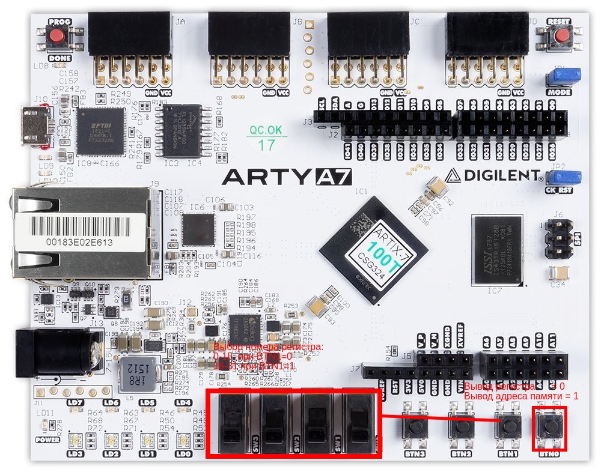

# Часть 3. Работа с имплементацией ядра SCHOOL RISC-V в FPGA
# Лабораторная работа №3
- Используя файлы которые вы получили в работе №2 посмотрите как выполняется ваша программа на прототипе ядра
- Измените поведение какой-нибудь инструкции в процессоре, например ADD и посмотрите к чему это приведёт
- Добавьте свою custom инструкцию
# Какая информация выводится на индикатор
Переключателями вы можете выбирать номер выводимого регистра, если =0, выводится счётчик команд

BTN0 отвечает за выбор (вывод регистра=0/вывод адреса памяти инструкций=1)


# Описание ядра
В данной лабораторной работе вы будете использовать простое процессорное ядро RISC-V которое поддерживает следующие инструкции:

| Инструкция | Описание                               |
|------------|----------------------------------------|
| ADD        | Сложение двух регистров                |
| OR         | Побитовое ИЛИ над двумя регистрами     |
| SRL        | Логический сдвиг вправо                |
| SLTU       | Установить в 1 если регистр равен 0    |
| SUB        | Вычитание двух регистров               |
| ADDI       | Сложение с константой(16 бит знаковые) |
| BEQ        | Переход если равно                     |
| LUI        | Записать в старшую часть регистра      |
| BNE        | Переход если не равно                  |


**Более подробное описание этих команд вы можете найти здесь:**
[risc-v spec](./doc/riscv-isa-volume-1.pdf)

В каталоге ```./lab3.1/src/cpu``` находятся исходные файлы описания процессорного ядра.
```
cpu
├── instruction_rom.sv   - Память инструкций
├── memfile.dat          - Файл с инструкциями в шестнадцатеричном формате
├── register_with_rst.sv - Регистр со сбросом
├── sr_alu.sv            - Арифметико-Логическое устройство
├── sr_control.sv        - Устройство управления
├── sr_cpu.sv            - Модуль верхнего уровня процессорного ядра
├── sr_cpu.svh           - Файл с параметрами
├── sr_decode.sv         - Дешифратор инструкций
└── sr_register_file.sv  - Регистровый файл
```